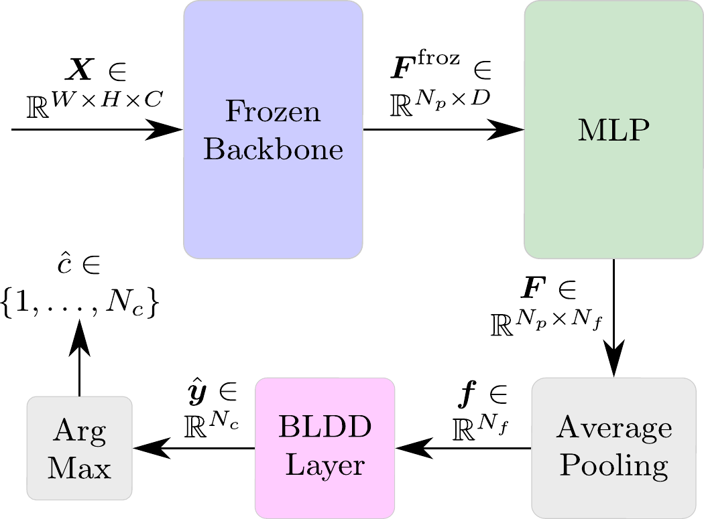

# DINO-QPM: Adapting Visual Foundation Models for Globally Interpretable Image Classification

[](<placeholder>)

Although visual foundation models like DINOv2 provide state-of-the-art performance as feature extractors, their complex, high-dimensional representations create substantial hurdles for interpretability. This work proposes DINO-QPM, which converts these powerful but entangled features into contrastive, class-independent representations that are interpretable by humans. DINO-QPM is a lightweight interpretability adapter that pursues globally interpretable image classification, adapting the Quadratic Programming Enhanced Model (QPM) to operate on strictly frozen DINO backbones. While classification with visual foundation models typically relies on the CLS token, we deliberately diverge from this standard. By leveraging average-pooling, we directly connect the patch embeddings to the model's features and therefore enable spatial localisation of DINO-QPM's globally interpretable features within the input space. Furthermore, we apply a sparsity loss to minimise spatial scatter and background noise, ensuring that explanations are grounded in relevant object parts. With DINO-QPM we make the level of interpretability of QPM available as an adapter while exceeding the accuracy of DINOv2 linear probe. Evaluated through an introduced Plausbility metric and other interpretability metrics, extensive experiments demonstrate that DINO-QPM is superior to other applicable methods for frozen visual foundation models in both classification accuracy and explanation quality. 
<br>

## DINO-QPM Pipeline
<div style="display: flex; align-items: center;">
  <div style="width: 50%; border-right: 2px solid #ccc; padding-right: 20px; margin-right: 20px; display: flex; justify-content: center; align-items: center;">
    
  </div>

  <div style="width: 50%;">
    <p>This text is now perfectly centred vertically relative to the image on the left.</p>
    <p>Because the image's container is also a flexbox, the 80% width image is now floating perfectly in the middle of its designated left-hand space.</p>
  </div>
</div>

## Code

## Installation (Conda + Editable Install)

From the repository root:

```bash
conda env create -f environment.yml
conda activate NewDino
python -m pip install --upgrade pip
python -m pip install -e .
```

Quick sanity checks:

```bash
python -c "import CleanCodeRelease; print('ok')"
python main.py --help 2>/dev/null || true
```

## Dataset Setup (Local)

By default, data is expected under:

- `~/tmp/Datasets`

At runtime, `main.py` sets `CCR_DATASETS_ROOT` automatically with a local-first policy, then falls back to `~/tmp/Datasets`.

Expected dataset folders:

```text
~/tmp/Datasets/
├── CUB200/
└── StanfordCars/
```

## Configuration

Main config routing is resolved automatically from `configs/` based on selected settings.

Typical parameters to check first:

- `dataset`
- `arch`
- `model_type`
- `sldd_mode`
- Train/finetune hyperparameters in the corresponding config files

## Run the Code (Local)

Entry point:

- `main.py`

Supported subcommands:

- `train`
- `inference`
- `evaluate`

### 1. Training

```bash
python main.py train --seed 504405 --run_number 0
```

Common optional args:

- `--log_dir <path>`
- `--multi-seed`
- `--slurm_log <path>` (can still be passed locally if your workflow expects it)

### 2. Inference

```bash
python main.py inference \
  --model-path /path/to/model_checkpoint.pth \
  --image-dir /path/to/images \
  --batch-size 32 \
  --top-k 5 \
  --output-json /path/to/predictions.json
```

Optional visualization flags:

```bash
--visualize-feature-maps
--viz-dir /path/to/viz_output
--viz-max-features 8
```

### 3. Evaluation

```bash
python main.py evaluate \
  --model-path /path/to/model_checkpoint.pth \
  --mode finetune \
  --eval-mode all \
  --output-json /path/to/eval_results.json
```

Useful options:

- `--config-file /path/to/config.yaml`
- `--dataset <dataset_name>`
- `--save-features`

Re-run editable install from repo root:

```bash
python -m pip install -e .
```

The code will follow soon.

## Citation

If you use this work, please cite:

```bibtex
@misc{zimmermann2026dino-qpm,
  title         = {{DINO-QPM}: Adapting Visual Foundation Models for Globally Interpretable
Image Classification},
  author        = {Zimmermann, Robert and Norrenbrock, Thomas and Rosenhahn, Bodo},
  year          = {2026},
  eprint        = {...},
  archivePrefix = {arXiv},
  primaryClass  = {cs.CV},
  url           = {https://arxiv.org/abs/...}
}
```
 
Once published at CVPR, please use:
 
```bibtex
@inproceedings{zimmermann2026dino-qpm,
  title     = {{DINO-QPM}: Adapting Visual Foundation Models for Globally Interpretable
Image Classification},
  author    = {Zimmermann, Robert and Norrenbrock, Thomas and Rosenhahn, Bodo},
  booktitle = {...},
  year      = {2026}
}
```
