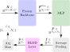

# DINO-QPM: Adapting Visual Foundation Models for Globally Interpretable Image Classification

<!--[](<placeholder>)-->
<p align="center">
  
</p>

<div align="center">

<em>Overview of our proposed DINO-QPM. The pipeline processes the (a) input image using the frozen backbone to produce patch embeddings, which are transformed by the interpretability adapter to obtain a globally interpretable image classification. We compare the diffuse saliency map of (b) DINO GradCAM, extracted from a linear probed DINO model, with our (c) DINO-QPM local explanation. The local explanation can be further decomposed into its (d) class-independent diverse features. Compared to the baseline, we observe a drastic increase in localisation quality, showcasing how our interpretability adapter successfully isolates semantically meaningful features.</em>

</div>

## Abstract

Although visual foundation models like DINOv2 provide state-of-the-art performance as feature extractors, their complex, high-dimensional representations create substantial hurdles for interpretability. This work proposes DINO-QPM, which converts these powerful but entangled features into contrastive, class-independent representations that are interpretable by humans. DINO-QPM is a lightweight interpretability adapter that pursues globally interpretable image classification, adapting the Quadratic Programming Enhanced Model (QPM) to operate on strictly frozen DINO backbones. While classification with visual foundation models typically relies on the CLS token, we deliberately diverge from this standard. By leveraging average-pooling, we directly connect the patch embeddings to the model's features and therefore enable spatial localisation of DINO-QPM's globally interpretable features within the input space. Furthermore, we apply a sparsity loss to minimise spatial scatter and background noise, ensuring that explanations are grounded in relevant object parts. With DINO-QPM we make the level of interpretability of QPM available as an adapter while exceeding the accuracy of DINOv2 linear probe. Evaluated through an introduced Plausibility metric and other interpretability metrics, extensive experiments demonstrate that DINO-QPM is superior to other applicable methods for frozen visual foundation models in both classification accuracy and explanation quality.

## Architecture

<table width="100%">
  <tr valign="middle">
    <td width="50%" align="center">
      
      <br>
    </td>
    <td width="50%">
      <p>The input image is first processed by a <b>frozen backbone</b> (e.g. DINOv2), which yields patch-level feature maps and a global vector (CLS-like token). Although DINO-QPM relies exclusively on the patch embeddings, alternative extraction strategies (such as direct global-vector usage or mixed pooling) are fully supported and selectable via the configuration.</p>
      <p>We then apply the <b>MLP</b> to extract domain-specific representations, which are subsequently <b>average-pooled</b> to form the feature vector. Following this, our <b>BLDD Layer</b> performs a binary low-dimensional transformation: it selects a global pool of 50 features and allocates exactly 5 of these to each class.</p>
      <p>This process generates the final output vector, containing a likelihood score for every class. The highest score ultimately dictates the predicted classification.</p>
    </td>
  </tr>
</table>
<br>

## Results

<p align="center">
  
</p>

<div align="center">

*Comparison with state-of-the-art interpretable models. We report Accuracy, Plausibility, SID@5, Class-Independence, and Contrastiveness (all metrics in %). Features of a model are localised if they have a direct connection to the feature vector used for classification. The Plausibility metric is evaluated only on CUB-2011 due to the availability of segmentation masks. Dense* $\boldsymbol{F}^{\text{froz}}$ *is the dense model of DINO-QPM and DINOv2* $\boldsymbol{f}_{\text{CLS}}^{\text{froz}}$ *Linear Probe is a linear probe trained on top of the frozen `CLS` representation. For DINO-SLDD and DINO-QSENN, we employ a pipeline closely resembling our proposed method, with the exception of the feature selection mechanisms, which follow prior work. [^1][^2][^6]*

</div>

## DINO-QPM: A Global Interpretability Adapter

<p align="center">
  
</p>

<div align="center">

*Comparison of a Brewer's Blackbird image with a Rusty Blackbird image. From the selected features* $\mathcal{F}^{\ast}$, $N_f^{\hat{c}}=5$ *utilised features were selected for both classes using the QP; the corresponding feature maps from* $\boldsymbol{F}$ *are visualised as saliency maps. Both classes share 4 out of the 5 features and can thus be distinguished by the non-shared features. Notably, the model differentiates the Brewer's Blackbird using feature 24, which localises the beak. This aligns perfectly with established ornithological expertise, where beak morphology is considered a primary diagnostic trait.[^3][^4]*

</div>

## Code

Before being able to run the installation a Conda distribution must be installed (Anaconda or Miniconda).[^5]

### Installation

From the repository root:

```bash
conda env create -f environment.yml
conda activate DINO-QPM
python -m pip install --upgrade pip
python -m pip install -e .
```

### Dataset Setup

By default, data is expected under:

- `~/tmp/Datasets`

Expected dataset folders:

```text
~/tmp/Datasets/
├── CUB200
│   └── CUB_200_2011
│       ├── attributes
│       ├── class_sim_gts
│       ├── images
│       ├── parts
│       └── segmentations
├── StanfordCars
│   ├── car_devkit
│   ├── cars_test
│   └── cars_train
└── dino_data
    ├── CUB2011
    │   └── ...
    └── StanfordCars
        └── ...
```

#### CUB-200-2011

Download `CUB_200_2011.tgz` from the [official Caltech project page](https://www.vision.caltech.edu/datasets/cub_200_2011/) (mirror: [Caltech Data](https://data.caltech.edu/records/65de6-vp158)) and extract it into `~/tmp/Datasets/CUB200/`:

```bash
mkdir -p ~/tmp/Datasets/CUB200
tar -xzf CUB_200_2011.tgz -C ~/tmp/Datasets/CUB200
```

The archive already contains the expected `CUB_200_2011/` directory with `images/`, `images.txt`, `image_class_labels.txt`, `train_test_split.txt`, `attributes/`, `parts/` and `segmentations/`.

#### Stanford Cars

The dataset is no longer hosted at the original Stanford URLs. The easiest way is to let the [`StanfordCarsClass`](dino_qpm/dataset_classes/stanfordcars.py) loader fetch it from the Kaggle mirror — it will pull and unpack the archive into `~/tmp/Datasets/StanfordCars/` automatically on first use (requires Kaggle credentials in `~/.kaggle/kaggle.json`):

```bash
pip install kaggle
# place your kaggle.json under ~/.kaggle/ (chmod 600)
python -c "from dino_qpm.dataset_classes.stanfordcars import StanfordCarsClass; StanfordCarsClass(train=True, transform=None, download=True)"
```

Alternatively, download the archives manually (e.g. from the [Kaggle mirror](https://www.kaggle.com/datasets/eduardo4jesus/stanford-cars-dataset)) and arrange them as:

```text
~/tmp/Datasets/StanfordCars/
├── car_devkit/
│   ├── cars_meta.mat
│   └── cars_train_annos.mat
├── cars_train/
├── cars_test/
└── cars_test_annos_withlabels.mat
```

The test annotations (`cars_test_annos_withlabels.mat`) are not bundled with the original devkit and must be added separately; one mirror is linked in [stanfordcars.py:70](dino_qpm/dataset_classes/stanfordcars.py#L70).

The `dino_data/` folder shown above is generated automatically the first time precomputed feature maps/vectors are written — it does not need to be downloaded.

### Model Weights

Pretrained backbone weights are expected under:

- `~/tmp/model_weights/`

The exact filename depends on the selected backbone (`arch` and `model_type`). Examples:

```text
~/tmp/model_weights/
├── dinov2_vitl14_pretrain.pth              # DINOv2 large
├── dinov2_vitb14_reg4_pretrain.pth         # DINOv2 base with registers
└── dino_vitbase16_pretrain.pth             # DINO base
```

Weights must be downloaded from the upstream repositories (DINO, DINOv2) and placed in this folder. A missing file raises a `FileNotFoundError` pointing at the expected path.

### Run the Code

Entry point:

- `main.py`

Supported subcommands:

- `train`
- `inference`
- `evaluate`

### 1. Training

<p align="center">
  
  <br>
  <em>An overview of the DINO-QPM training pipeline</em>
</p>

Note: `train` runs evaluation by default.
It evaluates the dense model after dense training and, when finetuning is enabled, evaluates the finetuned model as well.

Minimal run using defaults:

```bash
python main.py train
```

#### Configuration

Configuration is resolved in two steps:

1. General config (`dino_qpm/configs/main_training.yaml`)
2. Model config in `dino_qpm/configs/models` selected by `(sldd_mode, arch[, mlp])`, e.g. `qpm/dinov2.yaml`

Although our primary DINO-QPM configuration only utilises the patch embeddings from the frozen backbone, the codebase supports several alternative strategies. These can be configured via `model.arch_type` and `model.feat_vec_type`, which dictate exactly which features are extracted from the backbone and how they are processed following the MLP.

`model.arch_type`: Specifies whether the embedding of the CLS token returned by the frozen backbone is immediately concatenated with each of the patch embeddings (`concat`) or not (`normal`).
Note: `concat` is only compatible with `model.feat_vec_type=avg_pooling` and `model.feat_vec_type=max_pooling`.

`model.feat_vec_type`: Specifies what we demand the frozen backbone to return for downstream usage.

- `model.feat_vec_type=normal` uses the embedding of the CLS token for classification; patch embeddings are only used for visualisation purposes.
- `model.feat_vec_type=mean_avg_pooling`: Both CLS token and patch embeddings are processed by the MLP separately. Afterwards the results are each average-pooled; the feature vector results as the mean of both.
- `model.feat_vec_type=avg_pooling` derives the adapter feature vector from patch embeddings as an average-pooling over the patch embeddings processed by the MLP (DINO-QPM).
- `model.feat_vec_type=max_pooling` derives the adapter feature vector from patch embeddings as a max-pooling of the patch embeddings processed by the MLP.

### 2. Inference

```bash
python main.py inference \
  --model-path /path/to/model_checkpoint.pth \
  --image-path /path/to/image_or_folder \
  --output-json /path/to/predictions.json
```

### 3. Evaluation

```bash
python main.py evaluate \
  --model-path /path/to/model_checkpoint.pth \
  --mode finetune \
  --eval-mode all \
  --output-json /path/to/eval_results.json
```

## Citation

If you use this work, please cite:
 
```bibtex
@inproceedings{zimmermann2026dino-qpm,
  title     = {{DINO-QPM}: Adapting Visual Foundation Models for Globally Interpretable
Image Classification},
  author    = {Zimmermann, Robert and Norrenbrock, Thomas and Rosenhahn, Bodo},
  booktitle = {2026 IEEE/CVF Conference on Computer Vision and Pattern Recognition Workshops (CVPRW)},
  year      = {2026}
}
```

[^1]: Norrenbrock, Thomas, Marco Rudolph, and Bodo Rosenhahn. *Q-senn: Quantized self-explaining neural networks*. Proceedings of the AAAI Conference on Artificial Intelligence. Vol. 38. No. 19. 2024.
[^2]: Norrenbrock, Thomas, Marco Rudolph, and Bodo Rosenhahn. *Take 5: Interpretable Image Classification with a Handful of Features*.
[^3]: Rusty Blackbird Identification, *All About Birds*, Cornell Lab of Ornithology. https://www.allaboutbirds.org/guide/Rusty_Blackbird/id
[^4]: Carl Savignac. *COSEWIC Assessment and Status Report on the Rusty Blackbird, Euphagus Carolinus, in Canada*. Committee on the Status of Endangered Wildlife in Canada, Ottawa, 2006.
[^5]: [Anaconda Installation Instructions](https://docs.conda.io/projects/conda/en/latest/user-guide/install/index.html)
[^6]: Norrenbrock, Thomas, et al. *QPM: Discrete optimization for globally interpretable image classification*. The Thirteenth International Conference on Learning Representations. 2025.
